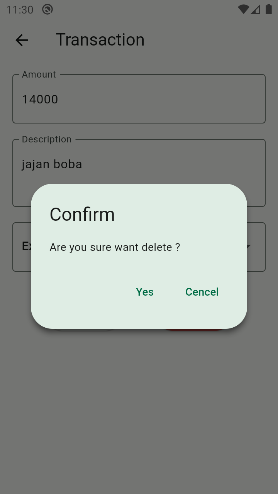

# Wallet Flutter

Sebuah project flutter aplikasi android sebagai sistem pencatatan keluar masukanya arus uang pribadi, project ini dibuat untuk memenuhi submission `Belajar Membuat Aplikasi Flutter untuk Pemula` di dicoding,
aplikasi ini terinspirasi dari project saya sebelumnya yaitu [Wallet Android](https://github.com/ajikamaludin/wallet-android) yang digunakan untuk #JuaraAndroid2022

### Tested on

- [x] Android
- [ ] iOS (Untested)
- [ ] Web (Untested)
- [ ] Linux (Untested)
- [ ] Windows (Untested)
- [ ] MaxOS (Untested)

# Screenshot

<table>
    <tr>
        <td>
            
        </td>
        <td>
            
        </td>
        <td>
            
        </td>
        <td>
            
        </td>
        <td>
            
        </td>
    </tr>
</table>

## Getting Started

This project is a starting point for a Flutter application.

A few resources to get you started if this is your first Flutter project:

- [Lab: Write your first Flutter app](https://docs.flutter.dev/get-started/codelab)
- [Cookbook: Useful Flutter samples](https://docs.flutter.dev/cookbook)

For help getting started with Flutter development, view the
[online documentation](https://docs.flutter.dev/), which offers tutorials,
samples, guidance on mobile development, and a full API reference.
